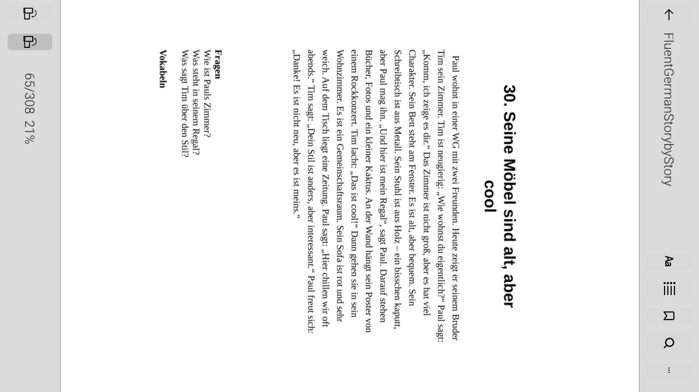
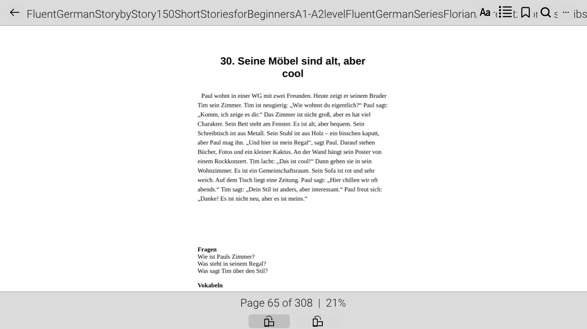
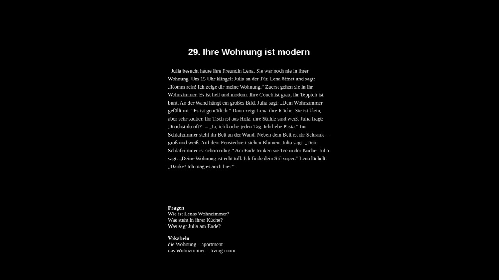

<p align="center">
  
</p>

<h1 align="center">Switchelf</h1>
<p align="center"><em>Your personal bookshelf for the Nintendo Switch.</em></p>

<p align="center">
  <strong>Switch</strong> + <strong>Shelf</strong> = <strong>Switchelf</strong>
</p>

<p align="center">
  
  
  
</p>

---

## Features

- **Save your place** — automatically remembers the last page you read.
- **Broad format support** — PDF, EPUB, CBZ, and XPS.
- **Comfortable reading** — Dark and light themes.
- **Flexible orientation** — Landscape and portrait reading views.
- **Touch controls** — tap the top/bottom of the screen to zoom in/out, and the left/right sides to turn pages.
- **Easy library management** — books are read from `/switch/Switchelf/books`.

## Screenshots

<p align="center">
  
  &nbsp;
  
</p>

<p align="center">
  
  &nbsp;
  
</p>

## Building

### Prerequisites (Debian/Ubuntu)

1. **Install devkitPro**

   ```bash
   sudo apt install build-essential make pkg-config

   # Add devkitPro APT repository
   sudo mkdir -p /usr/share/keyring/
   sudo wget -U "dkp apt" -O /usr/share/keyring/devkitpro-pub.gpg https://apt.devkitpro.org/devkitpro-pub.gpg
   echo "deb [signed-by=/usr/share/keyring/devkitpro-pub.gpg] https://apt.devkitpro.org stable main" | sudo tee /etc/apt/sources.list.d/devkitpro.list
   sudo apt-get update

   # Install Switch toolchain and portlibs
   sudo apt-get install devkitpro-pacman
   sudo dkp-pacman -S switch-dev libnx switch-portlibs
   ```

2. **Build**

   ```bash
   export DEVKITPRO=/opt/devkitpro
   make
   ```

3. **Clean**

   ```bash
   make clean
   ```

The output `.nro` will be placed in `dist/Switchelf.nro`.

> **Note:** If you do not have the twili debugger installed, build with `NODEBUG=1`:
> ```bash
> NODEBUG=1 make
> ```

## Contributing

Contributions are welcome! Whether it's bug reports, feature suggestions, or pull requests, feel free to get involved. Fork the repository, make your changes, and open a PR — we'd love to have you help make Switchelf better.

## Credits

- **Areshk** — Maintainer and lead developer of Switchelf.
- **[SeanOMik](https://github.com/SeanOMik)** — Original author of [eBookReaderSwitch](https://github.com/SeanOMik/eBookReaderSwitch); this project is a fork of their work.
- **moronigranja** — For enabling additional file format support.
- **NX-Shell Team** — A good portion of the codebase is derived from an earlier version of their application.

## License

This project is licensed under the GNU General Public License v3.0.
